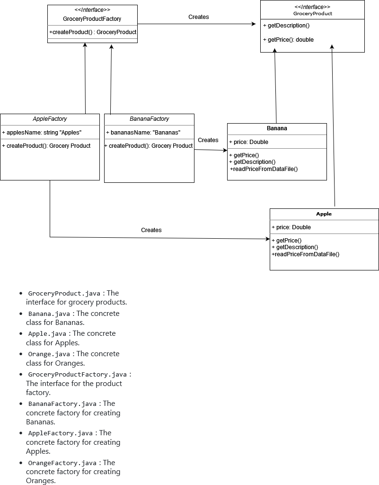
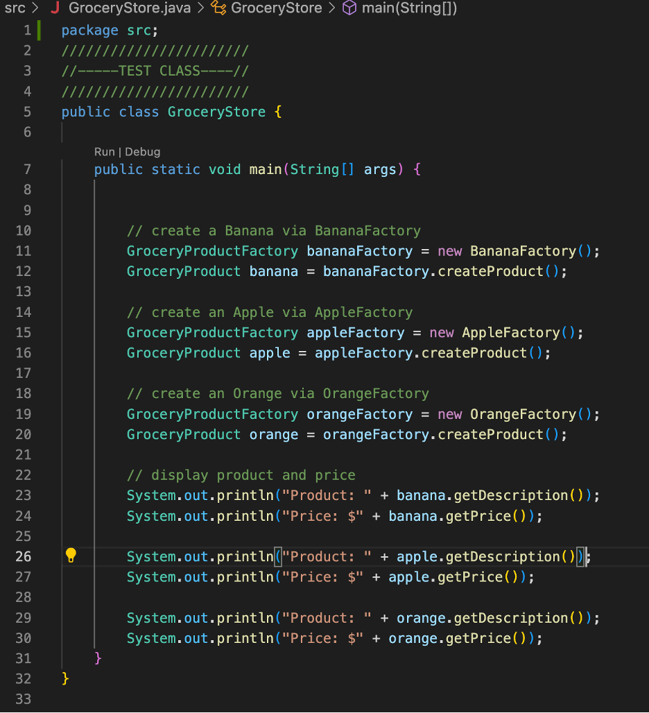
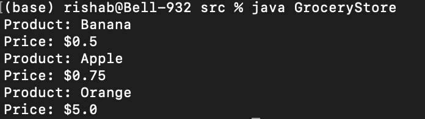
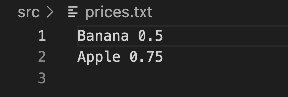
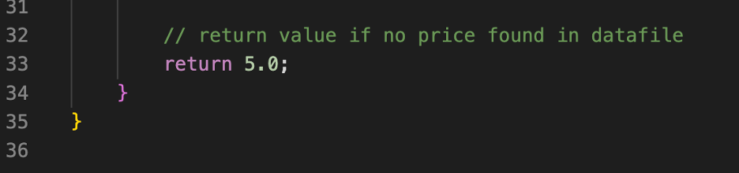

# abstract-factory-desgin-A1

UML DIAGRAM:


The repository is organized as follows:

- `src/`: This folder contains the Java source code for the project.
  - `GroceryProduct.java`: The interface for grocery products.
  - `Banana.java`: The concrete class for Bananas.
  - `Apple.java`: The concrete class for Apples.
  - `Orange.java`: The concrete class for Oranges.
  - `GroceryProductFactory.java`: The interface for the product factory.
  - `BananaFactory.java`: The concrete factory for creating Bananas.
  - `AppleFactory.java`: The concrete factory for creating Apples.
  - `OrangeFactory.java`: The concrete factory for creating Oranges.
  - `GroceryStore.java`: The test driver class for demonstrating the code.
  - `prices.txt`: A data file containing fixed prices for grocery items.
- `README.md`: This README file.

In the `GroceryStore` class, we demonstrate the creation of grocery products (Bananas, Apples, and Oranges) using the respective factories. Here's how it works:



Example Execution Screenshots

When you run the GroceryStore class, you should see output similar to the following:

```
Product: Banana
Price: $0.5

Product: Apple
Price: $0.75

Product: Orange
Price: $5.0
```



As you can see, the prices are pulled and dislplayed from the datafile 'prices.txt':



Since there is no data for the price of Oranges, it displays a default value set for oranges as shown in the Orange.java class:


